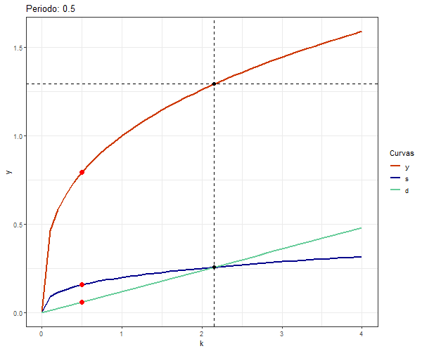

# Convergencia-Animada
Gráfico utilizando ggplot y gganimate que muestra la convergencia hacia un Estado Estacionario.
Utilicé el modelo de crecimiento económico de Solow-Swan, sin crecimiento de la tecnología.
La convergencia fue graficada para un nivel de capital por trabajador menor al Estado Estacionario,
por lo cual, la economía debe converger a su derecha (ahorro>depreciación), hasta alcanzar una situación 
donde la variación del capital sea igual a cero.

